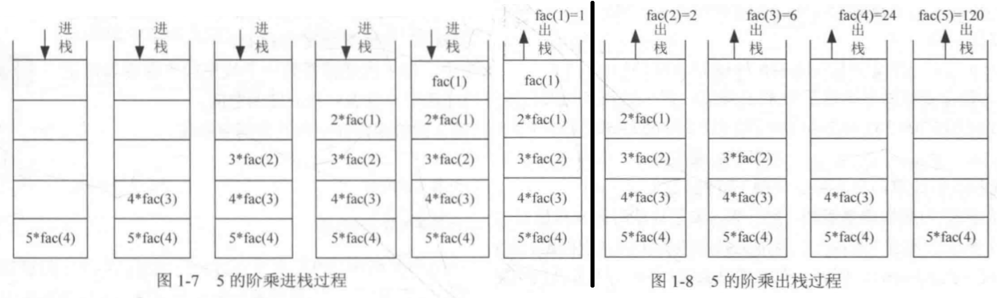

### 一、时间复杂度
1. 基础概念
    1. 如下代码
        ``` c++
        int demoFunc(int n)
        {
            int count = 0;              //运行一次
            for(int i=0;i<n;i++)        //运行n次
            {
                for(int j=0;j<n;j++)    //运行n次
                {
                    count++;            //运行n^n次
                }
            }
            return count;               //运行1次
        }
        ```
    1. 分析：示例代码中所有代码运行的总次数可以用一个函数 __T(n)__ 表示，且T(n)=1+n+n+n^n +1，而当n足够大时，T(n)→$n^n$，其余项都可以忽略不计,用极限表示就是： $lim\frac{T(n)}{f(n)}=C≠0$ ，所以用O(f(n))表示当前算法的时间复杂度。  
1. 再说明一个后面章节中经常遇到的 __O($\log_2 n$)__  
    1. 示例代码
        ``` c++
        int i;
        while(i<=n)
        {
            i=i*2;
        }
        ```
    1. 分析：无法确定循环体中的语句执行了多少次，现假设执行了x次，则算法结束的终点是：$2^x=n$，$n=\log_2 n$，所以时间复杂度：$O(f(n))=O(\log_2 n)$  

### 二、空间复杂度
1. 基础理论
    1. 主要就是统计算法所需要的额外的辅助空间,常规的交换函数，比如：
        ``` c++
            temp = i;
            i = j;
            j = temp;
        ```
        需要的额外的辅助空间为常数（不管是多少，只看是否为常数），所以对应的空间复杂度为O(1);
    1. 重点注意一下 __递归算法的空间复杂度__ 
        1. 以递归形式的阶乘为例：
            ``` c++
                int fac(int n)
                {
                    if(n<0) return -1;
                    if(n==0 || n==1)
                        return n;
                    else 
                        return n*fac(n-1)
                }
            ```
        1. 因为每一次递归都需要一个栈空间保存调用记录,所以空间复杂度计算的是所使用的 __递归栈__
        1. 递归包括递推、回归：递推就是将原问题不断地分解为子问题,直到达到结束条件,返回子问题的结果。
        回归就是逆向逐一回归子问题的结果,最终达到最开始的原问题。
        
        1. 额外需要的栈空间为n个，所以空间复杂度为O(n)
        1. 时间复杂度也是O(n),因为最多的单次运算是n*fac(n-1),若用T(n)表示算法的时间复杂度，则T(n)=T(n-1)+1=T[(n-2)+1]+1=……=T(1)+……+1=n。


